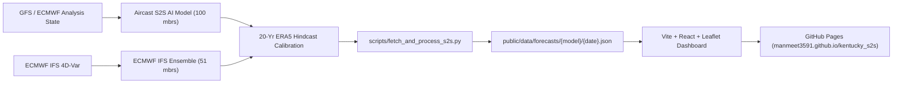

# Kentucky S2S · Subseasonal-to-Seasonal Forecasting Dashboard

[](https://manmeet3591.github.io/kentucky_s2s/)
[](https://manmeet3591.github.io/kentucky_s2s/)
[](https://manmeet3591.github.io/kentucky_s2s/)

An operational, high-resolution Subseasonal-to-Seasonal (S2S) forecasting product dashboard tailored specifically for the **Commonwealth of Kentucky**. Powered by **Aircast S2S** (deep neural atmospheric foundation model) and **ECMWF IFS S2S** (physics-based numerical ensemble), providing calibrated **Week 1 through Week 4** anomalies and tercile probabilities updated in near real time.

---

## 🌟 Key Features

- **Multi-Model Guidance**:
  - **Aircast S2S**: 100-member AI foundation model trained on multi-decadal atmospheric reanalyses (ERA5) and initialized with operational GFS analyses.
  - **ECMWF IFS S2S**: 51-member physics-based coupled ensemble benchmark.
  - **Model Consensus & Difference Mode**: Real-time evaluation of AI vs Physics model agreement and synoptic spread.
- **Lead Time Progression (Weeks 1 to 4)**:
  - **Week 1** (Days 1–7)
  - **Week 2** (Days 8–14)
  - **Week 3** (Days 15–21)
  - **Week 4** (Days 22–28)
  - **Full Subseasonal Outlook** (Days 1–28)
- **Meteorological Variables & Products**:
  - **2m Temperature Anomaly** (°F / °C vs 20-year climatology)
  - **Precipitation Anomaly** (% departure from normal and total accumulation in inches/mm)
  - **2m Mean Temperature**
  - **Total Accumulated Precipitation**
  - **Soil Moisture Standardized Anomaly** (0-10cm / root zone agricultural proxy)
  - **500 hPa Geopotential Height Anomaly** (mid-tropospheric ridge/trough drivers)
- **Kentucky Regional Focus**:
  - Interactive **Kentucky Climate Divisions** (Western Kentucky, Central Kentucky, Bluegrass, Eastern Kentucky).
  - High-precision station markers for **Kentucky Mesonet** and major airport observation nodes (Louisville SDF, Lexington LEX, Bowling Green BWG, Paducah PAH, Owensboro OWB, Frankfort FFT, Jackson JKL, Pikeville PBX, Covington CVG, Ashland HTS).
  - **Tercile Categorical Probabilities** (Probability of Above Normal, Near Normal, Below Normal).
  - **28-Day Daily Meteograms** with ensemble spread envelopes.
  - **Sector Impact Bulletins** for Kentucky agriculture, energy grid load (CDD/HDD), and river basin hydrology.
- **Automated Data Pipeline**:
  - GitHub Actions scheduled workflow (`.github/workflows/update_forecasts.yml`) automatically ingests new runs, calculates anomalies against the 20-year hindcast baseline, and redeploys to GitHub Pages.

---

## 🗺️ Kentucky Climate Divisions

| Division | Code | Major Cities & Coverage | Primary Focus |
| :--- | :--- | :--- | :--- |
| **Western** | `KY-01` | Paducah, Hopkinsville, Mayfield, Murray | Jackson Purchase & Western Pennyrile agriculture |
| **Central** | `KY-02` | Bowling Green, Owensboro, Elizabethtown | Western Coalfield, Knobs, and Green River basin |
| **Bluegrass** | `KY-03` | Louisville, Lexington, Frankfort, Covington | Urban metro energy demand & horse country |
| **Eastern** | `KY-04` | Pikeville, Hazard, Ashland, London | Cumberland Plateau, mountain hydrology & coalfields |

---

## 🏗️ Architecture



---

## 🚀 Quickstart & Local Development

### Prerequisites
- Node.js (v18+)
- Python (v3.10+)

### 1. Clone the repository
```bash
git clone https://github.com/manmeet3591/kentucky_s2s.git
cd kentucky_s2s
```

### 2. Install dependencies
```bash
npm install
```

### 3. Generate sample/operational S2S datasets
```bash
python3 scripts/generate_sample_data.py
python3 scripts/generate_geojson.py
```

### 4. Start local development server
```bash
npm run dev
```

Open [http://localhost:5173](http://localhost:5173) in your browser.

### 5. Build for production (GitHub Pages)
```bash
npm run build
```
Production assets are generated in `dist/`.

---

## 🔄 Automated Deployment to GitHub Pages

1. Push your repository to GitHub: `git remote add origin https://github.com/manmeet3591/kentucky_s2s.git`
2. In GitHub repository **Settings -> Pages**:
   - Source: **GitHub Actions**
3. The `.github/workflows/update_forecasts.yml` workflow will automatically run every Monday and Thursday at 06:00 UTC (and can be triggered manually via Workflow Dispatch) to update forecasts and deploy to `https://manmeet3591.github.io/kentucky_s2s/`.

---

## 📄 License

MIT License © 2026 [Manmeet Singh](https://github.com/manmeet3591).
